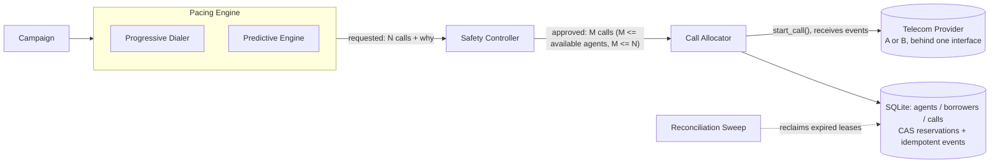
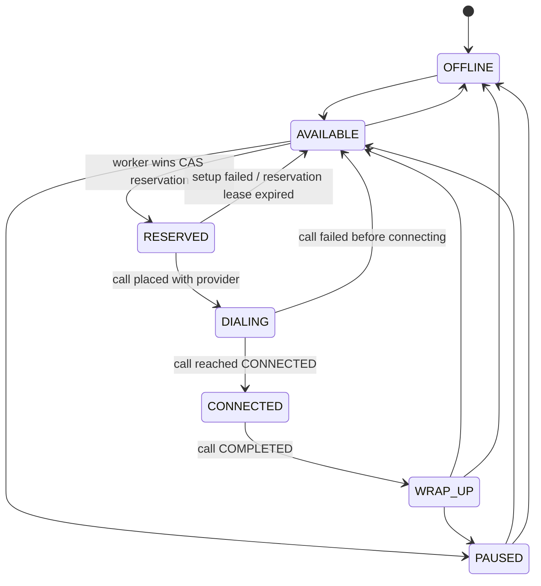
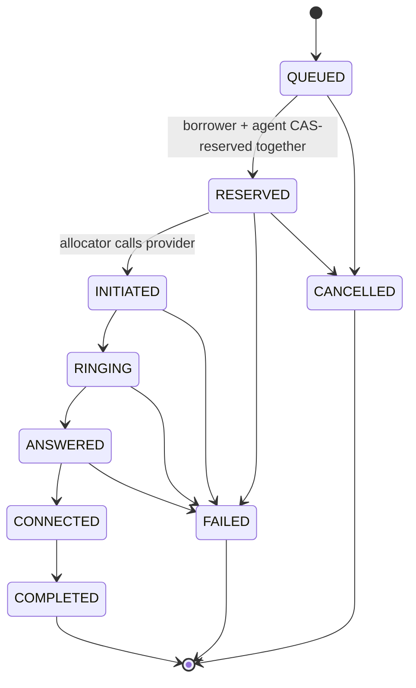
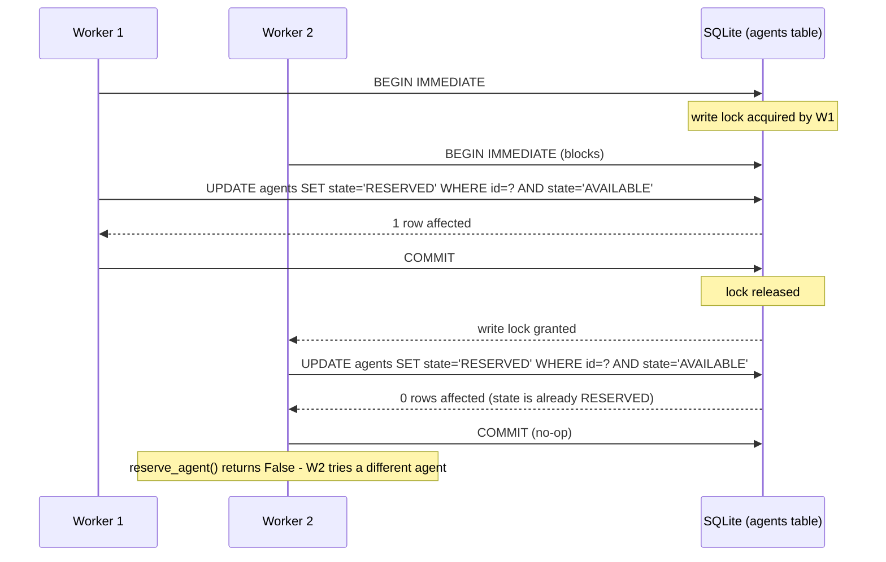
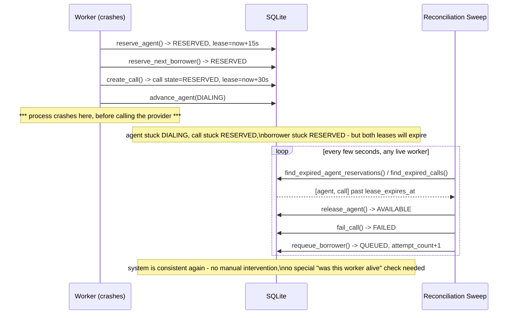
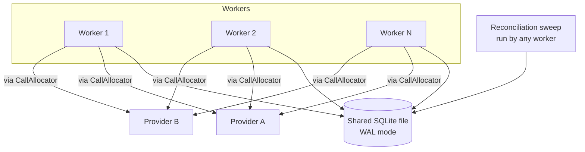

# Architecture

## 1. Pipeline

Key property: **the pacing engines have no reference to the Call
Allocator or the Provider at all** (see `worker.py` - `pacing_engine`
and `safety_controller` are separate objects; only the Safety
Controller's *approved* count ever reaches the allocation loop). A
predictive engine that wanted to bypass safety would have to be handed
a capability it structurally does not have.

## 2. Agent state machine

## 3. Call state machine

Provider events are **not** validated against this graph directly (see
`state_machines.call_event_is_forward_progress`). A real provider will
skip states, duplicate events, and reorder them, so the event-ingest
path uses a simpler, more robust rule: apply an incoming event only if
it represents forward progress and the call hasn't already reached a
terminal state. The graph above documents intent; the rank+terminal
guard is what actually survives contact with a messy provider.

## 4. Two workers race for the same agent

No application-level lock is involved. `BEGIN IMMEDIATE` plus a
`WHERE state = 'AVAILABLE'` guard on the UPDATE *is* the compare-and-
swap; it is enforced by SQLite's own locking, which is why the same
pattern (as a single `UPDATE ... WHERE` on Postgres/MySQL, or a
version-column CAS) works identically with real multi-process,
multi-host workers. See `tests/test_concurrency_race.py`, which runs
this exact scenario with 25 real OS threads.

## 5. Worker crash and recovery

The design choice here: **recovery does not try to detect that a
specific worker died.** It never asks "is worker W1 still alive?" -
that question is genuinely hard in a distributed system (see: every
paper ever written about failure detectors). Instead every reservation
carries a lease, and *not renewing a lease* is indistinguishable from,
and handled identically to, an actual crash. See
`tests/test_worker_crash_recovery.py`.

## 6. Multiple workers, one campaign

All N workers run the identical `Worker.tick()` loop against the same
DB file. There is no leader/coordinator and no partitioning of agents
or borrowers between workers - correctness comes entirely from the CAS
layer, so adding or removing workers requires no coordination protocol.
This is deliberately the simplest architecture that satisfies the
requirements; see ADR.md for why Kafka/Redis/a coordinator were not
introduced, and for where this specific choice stops scaling.
